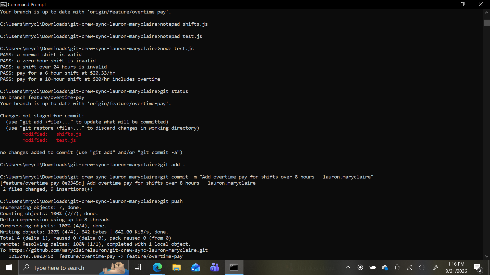
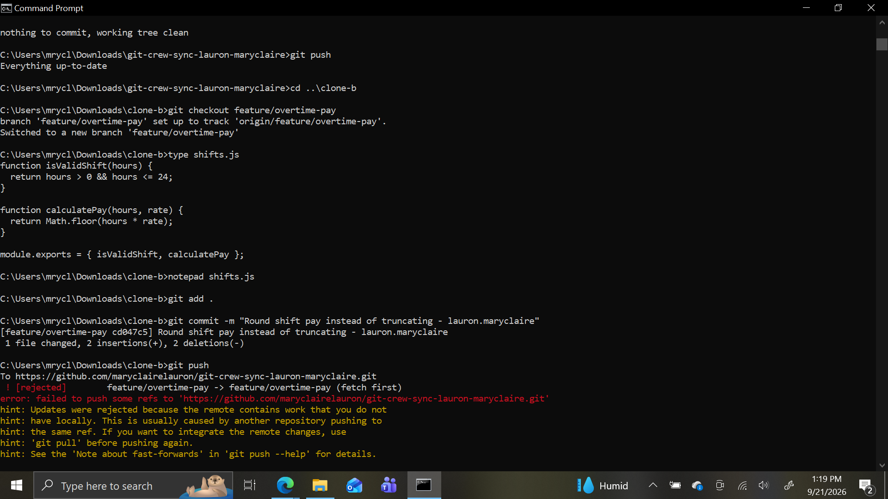
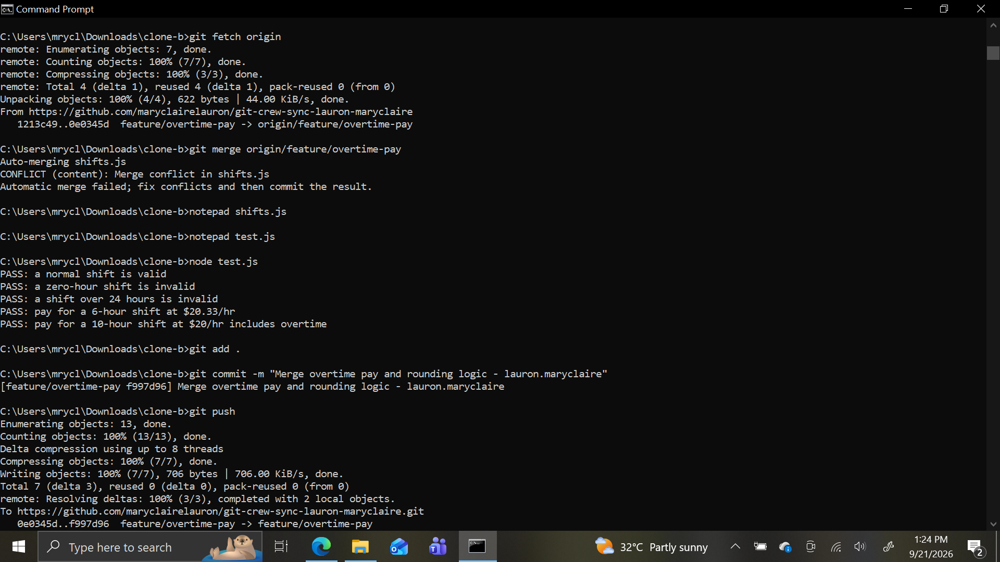
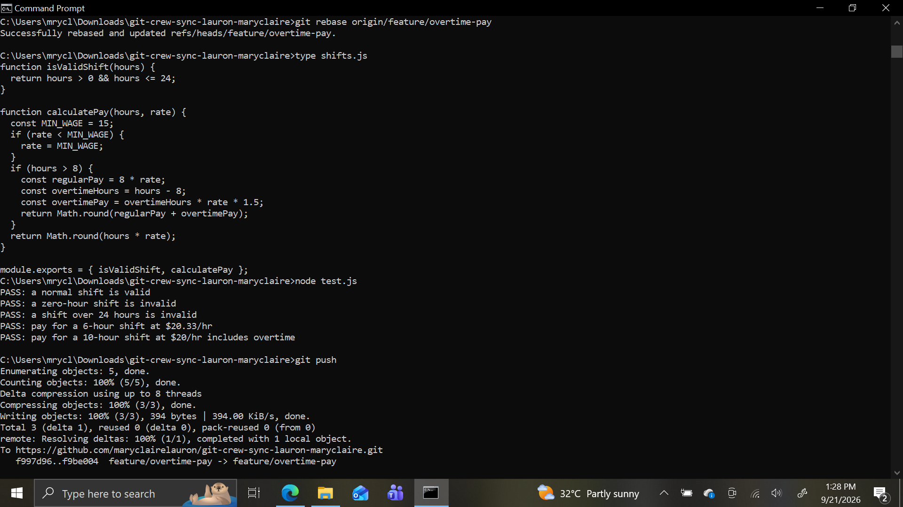
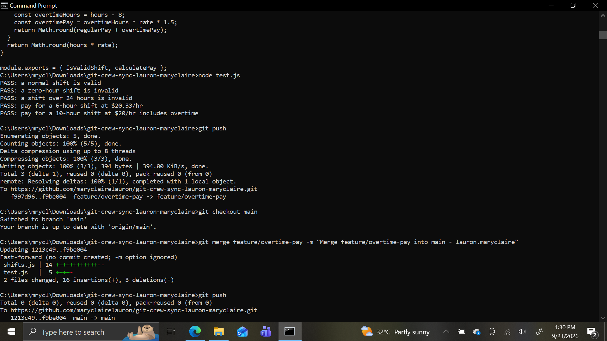
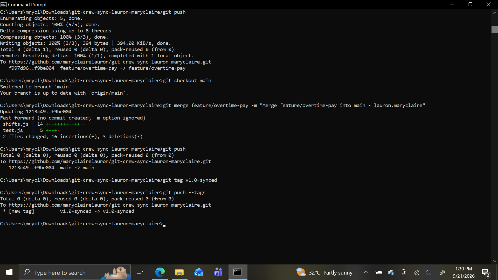

# Crew Sync: Reconciling Divergent Work — WORKFLOW.md

**Name:** Maryclaire Lauron
**Repo:** git-crew-sync-lauron-maryclaire

## Task 1 — Push from Clone A
Added overtime pay logic to `calculatePay`: shifts over 8 hours are paid at 1.5x the rate for hours beyond 8. Committed and pushed successfully from Clone A.

## Task 2 — Diverge from Clone B, get rejected
In Clone B (without fetching first), changed `calculatePay` to round pay instead of truncating it. Committed, then attempted to push — the push was rejected because Clone B's local branch was behind the remote (Clone A had already pushed a different change to the same function).

## Task 3 — Reconcile with a merge
Fetched and merged Clone A's changes into Clone B. Git flagged a real conflict in `calculatePay` since both branches edited the same lines. Resolved it by combining both behaviors: overtime pay calculation, with the final result rounded instead of truncated. Updated the affected test to expect the rounded value. All tests passed, then pushed successfully.

## Task 4 — Diverge again, reconcile with a rebase
In Clone A (without fetching first), added a minimum wage floor to `calculatePay`. Committed and tried to push — rejected again, for the same reason as Task 2. This time, resolved it with `git fetch` + `git rebase` instead of merge. Git combined the minimum wage floor and the rounding logic automatically. Ran tests to confirm everything passed, then pushed successfully without needing to force push.

## Task 5 — Merge into main
Merged the finished `feature/overtime-pay` branch into `main` and pushed. Since `main` hadn't diverged from the feature branch, git performed a fast-forward merge.

## Task 6 — Tag and push
Tagged the final commit `v1.0-synced` and pushed the tag to GitHub. Confirmed it appears on the repo's Tags page.

---

## Reflection Questions

**1. What did the rejected push error message tell you, and why did it happen?**

The error said the push was rejected because the remote contained work I didn't have locally, and suggested running `git pull` before pushing again. This happened because my local branch was based on an older version of the remote — someone else (in this case, my other clone) had already pushed a commit that moved the branch forward, so git refused to let me overwrite history I hadn't seen yet.

**2. What's the actual difference between how you resolved Task 3 (merge) vs Task 4 (rebase)?**

In Task 3, `git merge` created a new commit that combined both diverged histories side by side — the commit history shows both branches' commits, joined by a merge commit. In Task 4, `git rebase` rewrote my local commit so it applied on top of the latest remote commit, producing a linear history with no separate merge commit — it looks as if my change was made after the remote's change all along, rather than at the same time as it.

**3. What one habit would have avoided both rejected pushes in this lab?**

Running `git fetch` (or `git pull`) before starting new work on a shared branch. Both rejections happened because I made changes without first checking whether the remote had moved forward since my last sync.

**4. Which approach — merge or rebase — would you default to on a shared team branch, and why?**

I'd default to merge on a shared branch, because it preserves the true history of when each change actually happened and is safer when multiple people might be working off the same commits — rebase rewrites commit history, which can cause serious problems if someone else has already pulled the branch you're rebasing. I'd consider rebase for cleaning up my own local commits before ever pushing them, but not after they're shared.